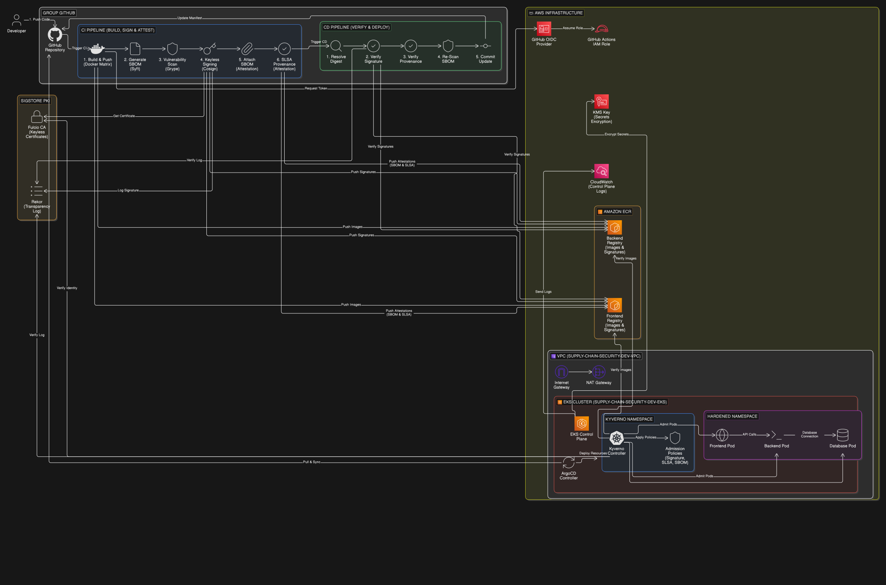
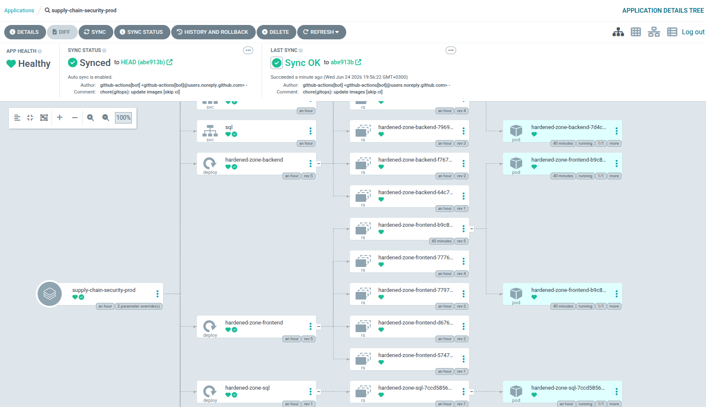
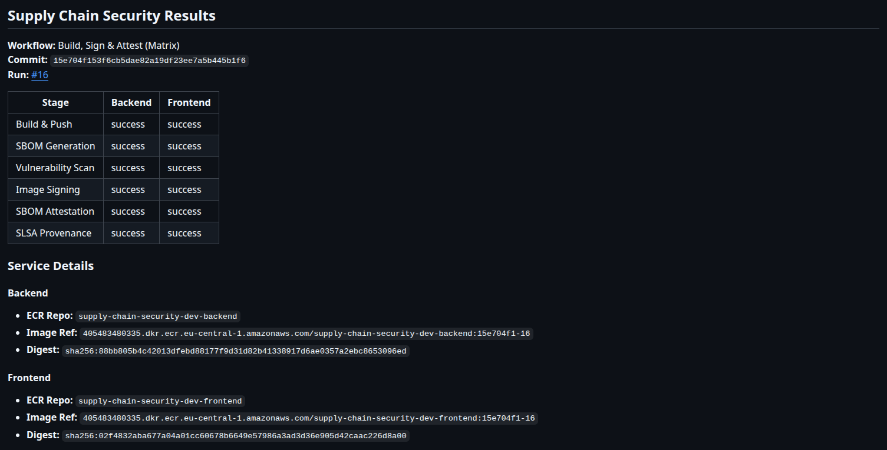
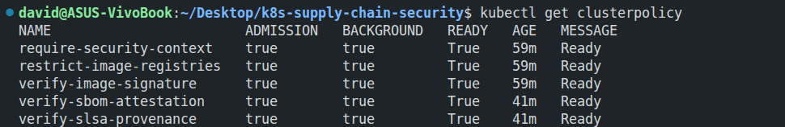
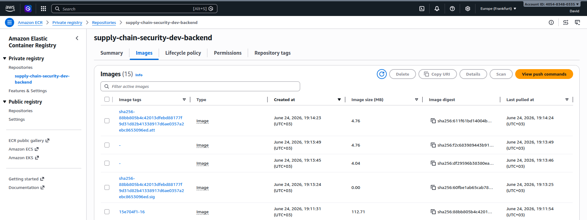
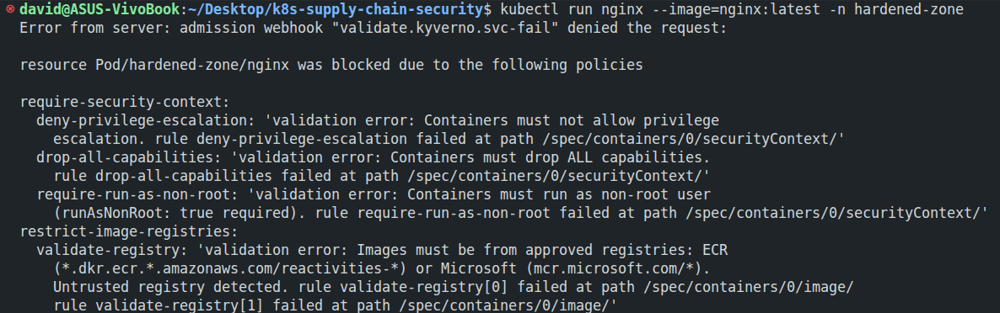
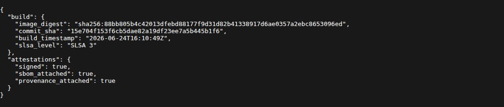

# Secure Kubernetes Supply Chain & GitOps Pipeline

A zero-trust, enterprise-grade cloud infrastructure project focused on securing the software supply chain. This repository demonstrates how to enforce cryptographic verification of container images—using SBOMs, keyless signing, and SLSA provenance—before they are allowed to run on a production Kubernetes cluster.

## Overview

Securing the software supply chain is no longer an optional "nice-to-have." With the rise of sophisticated attacks targeting build pipelines and impending regulatory frameworks (like the EU Cyber Resilience Act and CISA's secure development guidelines), organizations must be able to cryptographically prove the integrity of their deployments. If you can't verify exactly what is inside your container, who built it, and that it hasn't been tampered with, you are exposed.

This project tackles that exact problem by implementing a strict, end-to-end verification chain. The CI/CD pipeline doesn't just build and push an image; it generates machine-readable SBOMs (SPDX and CycloneDX), scans them for vulnerabilities, signs the artifacts using Sigstore's keyless OIDC architecture, and attaches SLSA provenance data. 

But a secure pipeline isn't enough if the runtime isn't protected. On the Kubernetes side, Kyverno acts as a strict admission controller. It intercepts every deployment request and blocks any pod that lacks a valid signature, proper provenance, or an SBOM attestation. 

The entire infrastructure is defined as code (Terraform), deployed via GitOps (ArgoCD), and operates entirely without static AWS credentials by leveraging GitHub OIDC federation and IAM Roles for Service Accounts (IRSA).

## Architecture



The deployment lifecycle is split into two distinct phases to ensure separation of concerns:

**Phase 1: Build, Sign, and Attest**  
A GitHub Actions workflow handles the initial build. Once the container image is built and pushed to Amazon ECR, Syft generates the SBOMs. Grype then scans these SBOMs to ensure no critical vulnerabilities are present. Finally, the image is signed using Sigstore Cosign (authenticating via the GitHub Actions OIDC token, leaving a public audit trail in Rekor), and the SLSA provenance and SBOM attestations are attached to the ECR registry as OCI artifacts.

**Phase 2: Verify and Deploy**  
Before anything touches the cluster, a secondary workflow re-validates the entire chain. It checks the Cosign signature against the specific GitHub Actions identity, verifies the SLSA provenance (ensuring it came from the correct repo), and runs a fresh vulnerability scan. Once cleared, the verified image digest is updated in the Git repository, triggering ArgoCD to sync the changes to the EKS cluster.

**Runtime Enforcement (The Last Line of Defense)**  
Even if a bad actor bypasses the CI pipeline and tries to deploy directly to the cluster via `kubectl`, they will be blocked. Kyverno enforces five strict `ClusterPolicies`:
1. The image must have a valid signature from the trusted OIDC identity.
2. The image must carry a valid SLSA provenance attestation.
3. The image must have a CycloneDX SBOM attached.
4. The image must originate from the approved private ECR registry.
5. The pod must adhere to strict security contexts (non-root, read-only filesystem, dropped capabilities).

## Tech Stack

**Cloud Infrastructure**: AWS EKS (v1.30), ECR, VPC (public/private subnets, NAT Gateway), KMS (secrets encryption), CloudWatch (logging), IAM OIDC Provider

**Infrastructure as Code**: Terraform (modular architecture with remote state in S3 + DynamoDB locking)

**CI/CD & GitOps**: GitHub Actions (OIDC authentication, no static credentials), ArgoCD (declarative GitOps), Helm (package management)

**Supply Chain Security**: Syft (SBOM generation — SPDX + CycloneDX), Sigstore cosign (keyless signing via OIDC), Rekor (immutable transparency log), SLSA provenance attestations

**Vulnerability Management**: Grype (SBOM-based CVE scanning at build and deploy gates)

**Policy Enforcement**: Kyverno (admission controller with 5 ClusterPolicies — signature verification, SLSA provenance, SBOM attestation, registry allowlist, Pod Security Standards)

**Identity & Access**: GitHub OIDC federation to AWS (workload identity), IRSA (IAM Roles for Service Accounts) for pod-level permissions

## Implementation Details

### SBOM Generation & Scanning
Syft is utilized to generate highly detailed Software Bill of Materials (SBOMs), producing the rich metadata in both SPDX and CycloneDX formats required for strict compliance frameworks (e.g., EU Cyber Resilience Act). Grype is then used to scan these generated SBOMs for vulnerabilities during the CI process.

### Kubernetes Admission Control
Kyverno is implemented as the cluster's admission controller. Its native Kubernetes YAML policies reduce operational friction compared to Rego-based alternatives. Additionally, Kyverno's built-in `verifyImages` rule provides straightforward, native integration with Sigstore Cosign for cryptographic signature verification.

### Keyless Image Signing
To avoid the operational overhead and security risks of managing long-lived private keys, Sigstore's keyless signing model is used. The signing identity is dynamically derived from the GitHub Actions OIDC token. Fulcio issues a short-lived certificate, the signature is logged immutably in Rekor, and the certificate expires immediately.

### Defense in Depth
Verification occurs both in the CI pipeline and within the cluster. Enforcing verification at the Kubernetes API server level with Kyverno ensures that no unverified image can ever spin up a pod, even if the CI pipeline is bypassed via direct `kubectl` access.

### GitOps Deployment
ArgoCD maintains the desired state of the cluster via version-controlled Git repositories. This provides automated drift detection, easy rollbacks, and a clear audit trail of deployments, removing the need for complex deployment scripts in the CI pipeline.

### Modular Infrastructure
The AWS infrastructure is structured into logical, reusable Terraform modules (VPC, EKS, ECR, Kyverno, ArgoCD, OIDC). This approach facilitates the creation of ephemeral environments, manages blast radii, and ensures safe infrastructure promotion using remote S3 state and DynamoDB locking.

## Screenshots

### ArgoCD Dashboard
ArgoCD managing the application deployment with automatic sync enabled, health status monitoring, and Git source tracking.



### GitHub Actions Build Results
Complete build-sign-attest pipeline execution showing successful SBOM generation, vulnerability scanning, image signing, and attestation attachment.



### Kyverno Policies
Five ClusterPolicies in Enforce mode ensuring supply chain security: image signature verification, SLSA provenance validation, SBOM attestation check, registry restriction, and security context hardening.



### ECR Signed Images
Amazon ECR repository showing the application image alongside cosign signature (`.sig`) and attestation (`.att`) artifacts stored as OCI objects with matching digests.



### Kyverno Policy Enforcement
Kyverno admission webhook rejecting an unsigned `nginx:latest` image deployed to the `hardened-zone` namespace. The deployment is blocked by multiple policies: `require-security-context` (privilege escalation, capabilities, root user) and `restrict-image-registries` (untrusted registry).



### Supply Chain Metadata
Application endpoint exposing build provenance metadata: image digest, commit SHA, build timestamp, SLSA level, and attestation verification status.



## Infrastructure Deployment

### Prerequisites
- AWS CLI configured with appropriate credentials
- Terraform >= 1.5
- kubectl
- helm
- Docker (for local testing)

### Provision Infrastructure

```bash
# Initialize Terraform backend
cd terraform/environments/dev
terraform init

# Review infrastructure plan
terraform plan

# Deploy AWS infrastructure (VPC, EKS, ECR, Kyverno, ArgoCD)
terraform apply

# Configure kubectl
aws eks update-kubeconfig --region eu-central-1 --name supply-chain-security-dev-eks
```

### Deploy via GitOps

```bash
# Access ArgoCD UI
kubectl -n argocd port-forward svc/argo-cd-argocd-server 8080:80

# Get admin password
kubectl -n argocd get secret argocd-initial-admin-secret -o jsonpath="{.data.password}" | base64 -d; echo

# Apply these manifests to sync your GitOps applications into ArgoCD
kubectl apply -f ./argocd/projects/scs.yaml
kubectl apply -f ./argocd/root.yaml
```

### Validate Supply Chain Security

```bash
# Check Kyverno policies
kubectl get clusterpolicies

# Deploy an unsigned image to trigger policy violations (will be blocked)
kubectl run nginx --image=nginx:latest -n hardened-zone
```

## Security Highlights

### 1. Supply Chain Integrity
- **OIDC Keyless Signing**: Sigstore Cosign is tied directly to GitHub OIDC. This means no static private keys are stored or managed.
- **SLSA Level 2 Provenance**: Every build generates an attestation that cryptographically links the final container image back to the exact Git commit and builder identity.
- **Dual SBOMs**: Both SPDX and CycloneDX formats are generated to ensure maximum compatibility with vulnerability scanners and compliance auditors.
- **Immutable Audit Trail**: Every signature is logged in Rekor's public transparency log.

### 2. Kubernetes Admission Control
- **Strict Kyverno Policies**: Five `ClusterPolicies` run in `Enforce` mode within protected namespaces. If an image isn't signed or violates security contexts, it is actively blocked from running.
- **Attestation Enforcement**: Kyverno actively checks the OCI registry to ensure the CycloneDX SBOM and SLSA provenance artifacts are attached to the image digest.
- **Registry Whitelisting**: Pods can only pull images from approved, private ECR registries.
- **Pod Security Standards**: Enforced non-root execution, read-only root filesystems, and dropped Linux capabilities.

### 3. Identity & Access Management (IAM)
- **Zero Static Credentials**: The GitHub Actions pipeline authenticates to AWS using an OIDC provider. No long-lived `AWS_ACCESS_KEY_ID` secrets are used.
- **IRSA (IAM Roles for Service Accounts)**: Kyverno pods get their own scoped IAM roles to read from ECR, adhering to the principle of least privilege.
- **KMS Encryption**: All Kubernetes secrets in EKS are encrypted at rest using a customer-managed AWS KMS key.

### 4. Continuous Vulnerability Management
- **Shift-Left Scanning**: Grype scans the SBOM during the build phase and will break the build if critical CVEs are found.
- **Deploy-Time Re-scanning**: Before ArgoCD deploys the image, a secondary workflow re-scans the artifact against the latest CVE database to catch newly disclosed vulnerabilities.

### Observability & Audit
- **CloudWatch Logging**: VPC Flow Logs capturing rejected traffic and security group blocks
- **GitHub Actions Audit Trail**: Complete build and attestation history in workflow logs
- **ArgoCD Sync History**: Git-tracked deployment history with rollback capability
- **Kyverno Policy Reports**: Cluster-wide admission decision logs and violation reports

## Author

**David**

- Website: [davidlihor.com](https://davidlihor.com)
- GitHub: [github.com/davidlihor](https://github.com/davidlihor)
- LinkedIn: [linkedin.com/in/david-lihor](https://www.linkedin.com/in/david-lihor)